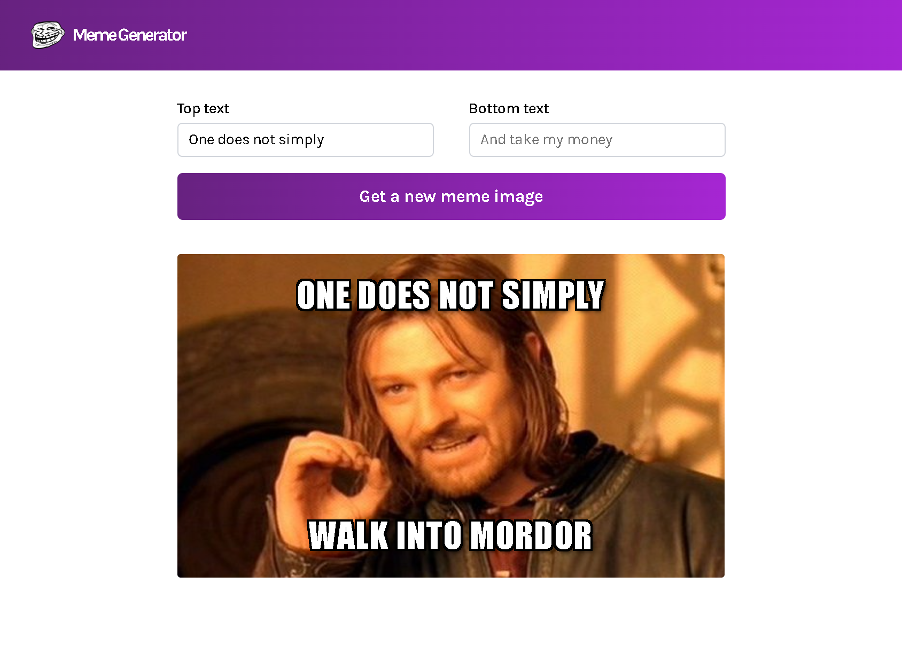

# Meme Generator 🎉

A fun and interactive **Meme Generator** built with **React**, **TypeScript**, and **SCSS**. This project allows users to generate memes with custom text on them. You can choose a random meme, type your own text for the top and bottom captions, and watch the meme update live as you type! 🤣

## Features 🚀

- **Random Meme Generator**: Click a button to get a random meme image from an array of memes.
- **Live Text Update**: Type into the top and bottom text inputs to dynamically change the text on the meme.
- **Simple and Fun**: No setup required, just open and enjoy!

## How It Works 🛠️

1. When the page is rendered, the app fetches an array of meme objects from an API.
2. Each meme has an image, a name, and text input placeholders (top and bottom text).
3. The user can type into the top and bottom text inputs, and the meme image will dynamically update with the new text as you type.
4. Click on the **"Get a new meme image"** button to fetch a random meme image from the array and display it.

### Example Meme Object

```json
{
	"success": true,
	"data": {
		"memes": [
			{
				"id": "61579",
				"name": "One Does Not Simply",
				"url": "https://i.imgflip.com/1bij.jpg",
				"width": 568,
				"height": 335,
				"box_count": 2
			},
			{
				"id": "101470",
				"name": "Ancient Aliens",
				"url": "https://i.imgflip.com/26am.jpg",
				"width": 500,
				"height": 437,
				"box_count": 2
			}
		]
	}
}
```

## Installation 🔧

There's no complicated setup involved, just follow these steps to run the app locally:

1. **Clone the repository:**

   ```bash
   git clone https://github.com/your-username/meme-generator.git
   ```

2. **Navigate to the project directory:**

   ```bash
   cd meme-generator
   ```

3. **Install dependencies:**

   ```bash
   npm install
   ```

4. **Run the app:**

   ```bash
   npm start
   ```

   The app should now be running on `http://localhost:3000`.

## Technologies Used ⚙️

- **React** – A JavaScript library for building user interfaces.
- **TypeScript** – A strongly typed programming language that builds on JavaScript.
- **SCSS** – A CSS preprocessor to write styles in a more maintainable way.

## Contributing 🤝

Contributions are welcome! If you find any bugs or want to add features, feel free to open an issue or submit a pull request.

### Steps to Contribute:

1. Fork the repository.
2. Create a new branch for your feature or bugfix.
3. Make your changes and ensure everything works properly.
4. Submit a pull request with a clear description of your changes.

## License 📄

This project is open-source and available under the [MIT License](LICENSE).

## Screenshot 📸



---

Have fun generating memes! 😆
